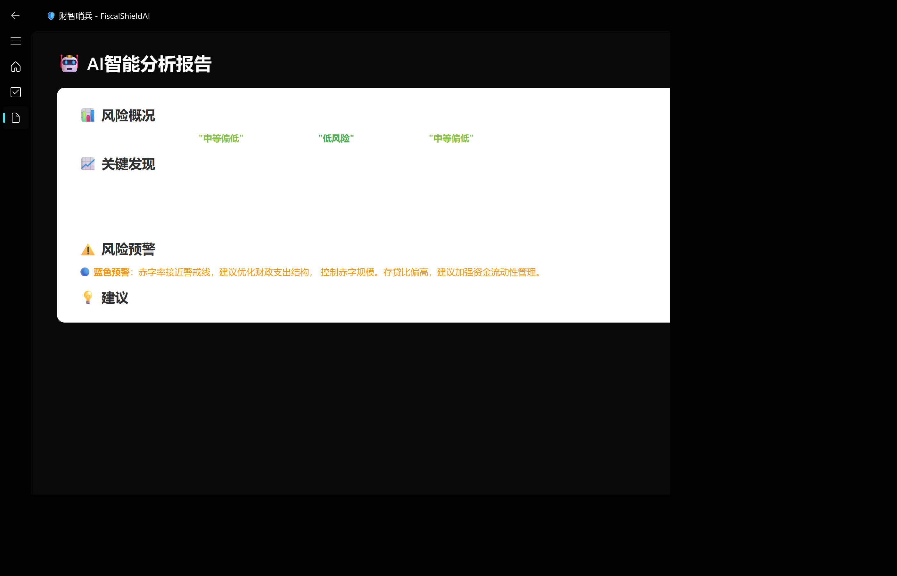

# FiscalShieldAI - Fluent Design 前端演示

> 基于 PyQt6 + PyQt-Fluent-Widgets 的财智哨兵前端界面

## 📸 效果预览

| 首页 | 风险预测 | AI报告 |
|------|---------|--------|
|  |  |  |

## 🚀 快速开始

### 环境要求

- Python 3.10+
- Windows 10/11

### 安装依赖

```bash
pip install PyQt6 PyQt6-Fluent-Widgets
```

### 运行演示

```bash
# 方式1：双击运行
run_demo.bat

# 方式2：命令行运行
python demo.py

# 方式3：自动截图
python screenshot.py
```

## 🎨 UI特色

- **Fluent Design风格**：微软现代UI设计语言
- **暗色主题**：深色背景 + 高对比度文字
- **卡片式布局**：圆角卡片 + 阴影效果
- **风险颜色编码**：绿/黄/橙/红直观区分风险等级
- **响应式导航**：左侧导航栏 + 页面切换动画

## 📁 项目结构

```
frontend_demo/
├── demo.py              # 主程序（完整界面）
├── screenshot.py        # 自动截图脚本
├── run_demo.bat         # Windows一键运行
├── requirements.txt     # Python依赖
├── README.md           # 说明文档
└── screenshots/        # 效果截图
    ├── 01_home.png
    ├── 02_predict.png
    └── 03_report.png
```

## 🔧 技术栈

- **Python 3.12**
- **PyQt6** - Qt6 Python绑定
- **PyQt6-Fluent-Widgets** - Fluent Design组件库

## 📝 说明

这是 FiscalShieldAI（财智哨兵）项目的前端演示版本，展示了基于Fluent Design的界面设计。

正式版前端将使用 **Qt 6.10 + C++** 开发，本Python版本主要用于：
1. 验证UI设计方案
2. 展示Fluent Design效果
3. 作为C++开发的参考模板

## 📚 参考资源

- [QFluentKit (C++版)](https://github.com/toddming/QFluentKit)
- [PyQt-Fluent-Widgets (Python版)](https://github.com/zhiyiYo/PyQt-Fluent-Widgets)
- [Fluent Design 官方文档](https://learn.microsoft.com/zh-cn/windows/apps/design/)

---

> **FiscalShieldAI** - 地方财政风险智能预警系统
> 泥很航事堆布队 · AIGC创新赛
